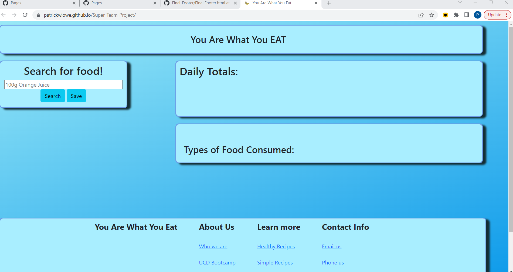

# You Are What You Eat
## Developers
#### Evan Carlson
#### Patrick Lowe
#### Karelyn Rojas
#### Nicolas Coiner
#### Gabreila Avelas
#
## Technologies Used

* JavaScript
* HTML
* CSS
* Visual Studio Code
* GitBash
* Web-API's
* JQuery
#
## Description
#### This is going to be an app that tracks your daily nutritional intake.
#### You will use the search bar tied to an API, connected to a database of nutritional facts. You will add your food and its weight to the search bar and receive nutritional facts based on the food type and weight. This info will then be logged to the local storage. Then the data will be compiled into a list of your daily nutritional intake based on calories, vitamins, etc. We will also incorporate an API tied to photos or gifs to produce images of the food searched to provide a more visually appealing ascetic.
#
## User Story
#### As a person watching my diet
#### I want to be able to monitor my daily nutrional intake 
#### SO that I can eat more healthily
#
## Acceptance Criteria
#### GIVEN a place to log the food you eat
#### WHEN I enter the amount of a certain kind of food I ate
#### THEN I am presented with the nutritional value and a picture of that food
#### WHEN I save that food item to the log
#### THEN that nutritional information is stored locally and persists on the page
#### WHEN I scroll to the bottom of the page
#### THEN I am presented with total amounts of the different nutritional value consumed that day
#
## Screenshot of Website 

## References 

#### https://www.pexels.com/api/
#### https://api.nal.usda.gov
#### 
#### 
#### 
#### 

## Link to the deployed website 

### https://patrickwlowe.github.io/Work-Day-Scheduler/

